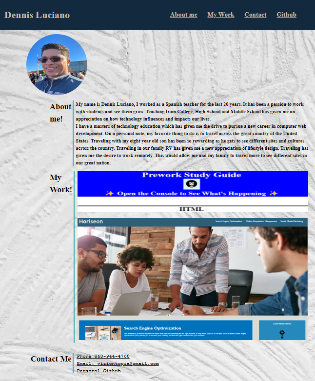

Dennis Luciano - Personal Portfolio

# Description:
This is a personal portfolio about Dennis Luciano. The portfolio showcases examples of student work and skills learned in the class. 

## Table of Content
We have a drop down “Menu” which contain:
About me section
Contact information section
Github section
Prework Study Guide
Refactoring Web page 

##  Usage
It's an introduction to Dennis Luciano, it provides personal contact information and showcases sample work. Employers are about to email, and call.  

## Credits
Collaboration with classmates, discussing best options and practice:
Dancarli Pascual,  and Mo Ager.

## License
MIT license through the use of GITHUB

## Screen Shot

